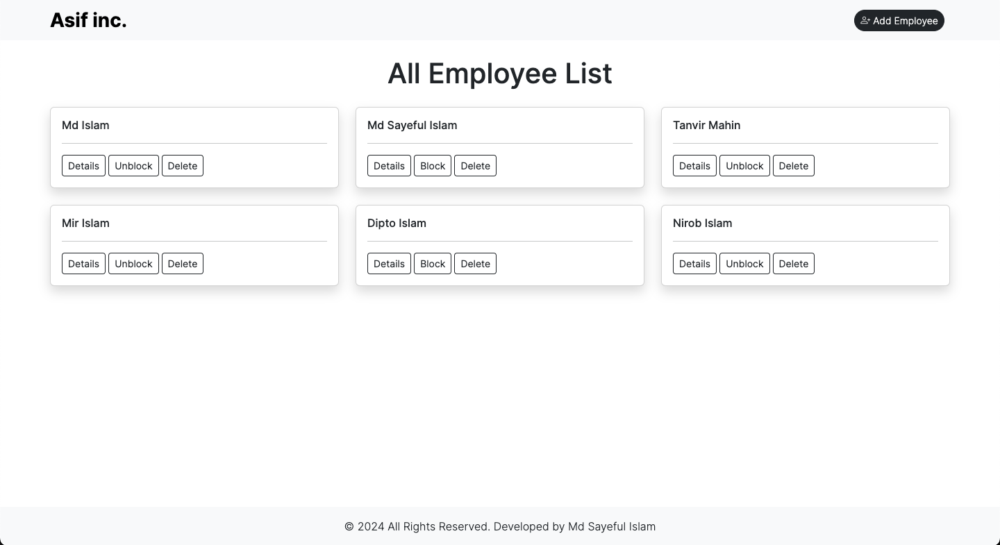
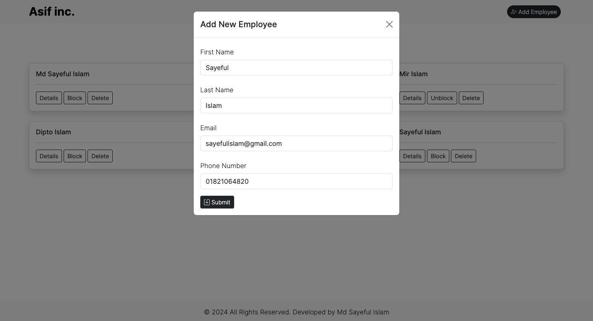
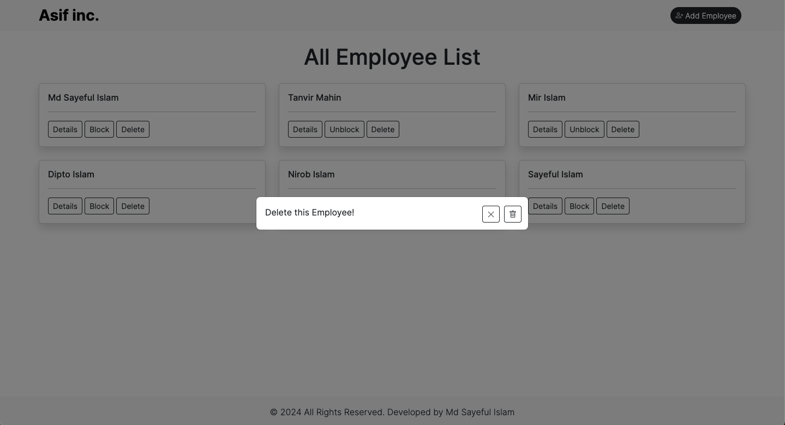
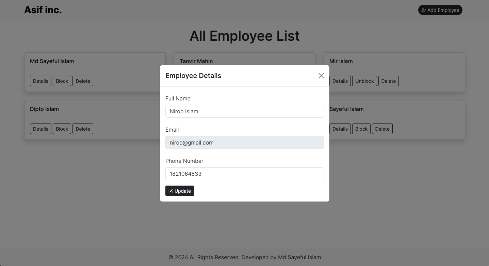

This is a responsive online Employee profile web app. Build an Frontend NextJs or Backend nodejs(express).

This web app using dependencies are:
Front-End Side
```bash
"axios": "^1.6.7",
"bootstrap": "^5.3.3",
"bootstrap-icons": "^1.11.3",
"next": "14.1.3",
"react": "^18",
"react-dom": "^18"
```
Back-End Side
```bash
"cors": "^2.8.5",
"express": "^4.18.3",
"mongoose": "^8.2.1"
```

## Technologies use
Frontend:
- NextJs App Router
- React Higher Order Components
- React Hooks (useEffect, useState, Custom Hooks)

Backend:
- Node.js
- Express.js
- MongoDB(mongoose)

Application functionality are:
- Create, Update, Delete, View and Block & Unblock Employee Profile
- responsive large, laptop, tablet, mobile screen.

## Getting Started
Highly recommended use chrome browser.

1. First download the code and run:

Client side and Server side folder
```bash
npm install
```

2. Run the development server:

Client side
```bash
npm run dev
```
Server side
```bash
node index.js
```

Open [http://localhost:3000](http://localhost:3000) with your browser to see the result.

## MERN Employee App view
Home page


Add new Employee


Delete Employee


Update Employee

